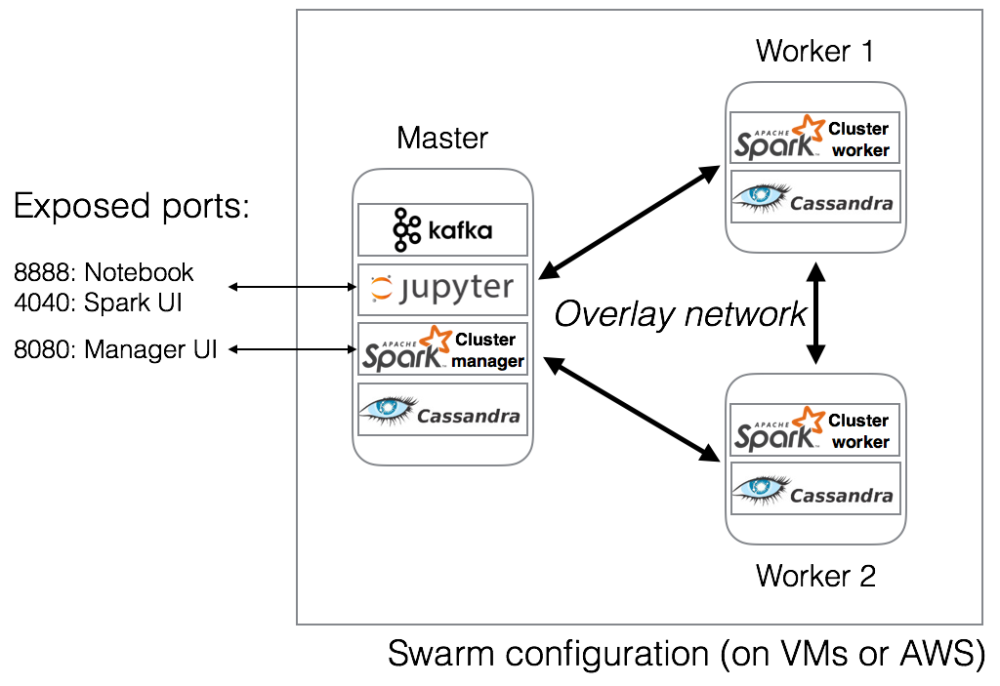

## Scalable Kafka - Spark streaming - Cassandra pipeline in Docker Swarm

This repository provides a basis to 

* Create clusters using docker-machine and Docker Swarm. We provide scripts to create clusters either locally using virtual machines, or on AWS (Amazon Web Services)
* Start Kafka, Spark cluster standalone, and Cassandra as Docker Swarm services
* Run an example demo using a Jupyter notebook connected to the cluster, where a Spark streaming application collects messages from Kafka and writes them to Cassandra




### Preliminary requirements

* Docker version 1.13.1 and docker-machine version 0.9.0
* Additionally: 
  * Virtual Box, in order to create virtual machines (VMs), and/or
  * An account on AWS, in order to create AWS instances. 

The scripts were tested using Mac OS 10.10.5 and Ubuntu 14.04, on a host (for VMs) with 16GB RAM and 2 CPUs. 


### Create cluster

Use the scripts in [cluster-management](cluster-management):

* `start-cluster-local.sh` : Creates a cluster of virtual machines.

* `start-cluster-aws.sh` : Creates a cluster of AWS machines.

The scripts create a 3 node cluster (one master and two workers) per default. See the [cluster management README](cluster-management/README.md) for more details. 

### Start services

Use the 'start all' script in the service-management folder to start all services

```
eval $(docker-machine env master)
start-all-services.sh
``` 

### Interact wih the cluster from a notebook

Connect to notebook demo container

```
docker run -it --network=cluster-network \
-p 8888:8888 -p 4040:4040 -p 23:22 \
yannael/notebook-demo bash
```

Create Cassandra database for demo script
```
cqlsh cassandra-seed -f init_cassandra.cql
```

Start notebook

```
notebook
```

Connect to masterIP:8888 in your browser (where masterIP is the IP of the master node of the cluster) to access the notebooks.


### Acknowledgments:

For providing base material to this repository

* [https://medium.com/@aoc/running-spark-on-docker-swarm-777b87b5aa3#.4ahmoqvsf](https://medium.com/@aoc/running-spark-on-docker-swarm-777b87b5aa3#.4ahmoqvsf)
* [https://github.com/big-data-europe](https://medium.com/@aoc/running-spark-on-docker-swarm-777b87b5aa3#.4ahmoqvsf)

For funding

* [BruFence: 'Scalable machine learning for automating defense system'](http://www.securit-brussels.be/project/brufence), a project funded by the Institute for the Encouragement of Scientific Research and Innovation of Brussels (INNOVIRIS, Brussels Region, Belgium)


